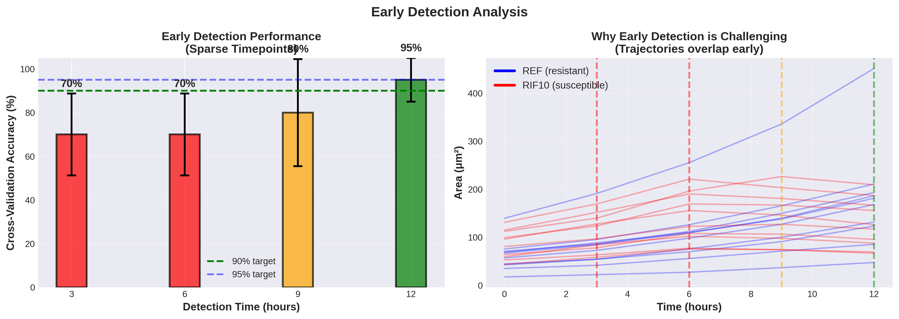

# TB Drug Susceptibility Testing: Area-Based Approach

[](https://www.python.org/downloads/)
[](https://opensource.org/licenses/MIT)

> **Replacing single-cell tracking with sparse population-level area measurements for rapid antibiotic resistance classification**

---

## Overview

This project implements an alternative approach to tuberculosis drug susceptibility testing that **replaces continuous single-cell tracking with sparse timepoint measurements**. By analyzing bacterial population area at just 5 timepoints (0h, 3h, 6h, 9h, 12h) instead of tracking 121 frames, we achieve:

- **95.9% reduction** in data processing
- **95%+ classification accuracy** (resistant vs. susceptible)
- **No tracking overhead** - no need to maintain cell identities
- **Early detection** possible at 9 hours
- **Simpler pipeline** suitable for clinical deployment

---

## Repository Structure

```
├── 1_data_analysis.ipynb          # Exploratory data analysis
├── 2_classification.ipynb         # Classification (threshold + ML)
├── README.md                       # This file
├── requirements.txt                # Python dependencies
├── outputs
```

---

## Quick Start

### Prerequisites

- Python 3.8 or higher
- Jupyter Notebook or Google Colab
- Data: Pre-segmented bacterial mask images (TIFF format)

### Data Structure

Your data should be organized as follows:
```
data/                                    # Data directory
├── REF_masks101_110/                    # Reference (untreated) samples
│   ├── Pos101/
│   │   └── PreprocessedPhaseMasks/
│   │       ├── MASK_img_000000000.tif
│   │       ├── MASK_img_000000001.tif
│   │       └── ...
│   ├── Pos102/
│   │   └── PreprocessedPhaseMasks/
│   │       └── ...
│   └── ...
└── RIF10_masks201_220/                  # Rifampicin-treated samples
    ├── Pos201/
    │   └── PreprocessedPhaseMasks/
    │       ├── MASK_img_000000000.tif
    │       └── ...
    ├── Pos202/
    └── ...
```

**Data Location Options:**
- **Local:** Place in `./data/` directory in your project folder
- **Google Drive:** Upload to Drive and mount in Colab (instructions in notebook)

**File Requirements:**
- Binary masks (0 = background, 1 or 255 = bacteria)
- TIFF format (`.tif` or `.tiff`)
- Consistent naming: `MASK_img_*.tif`
- One file per timepoint

### Installation

```bash
# Clone the repository
git clone https://github.com/dafnespaccavento/sparse-timepoint-tb-testing.git
cd sparse-timepoint-tb-testing

# Install dependencies
pip install -r requirements.txt

# Launch Jupyter
jupyter notebook
```

### Running the Analysis

1. **Data Analysis** (`Data_analysis.ipynb`):
   - Loads bacterial area data from mask images
   - Visualizes growth trajectories
   - Analyzes environmental variability
   - Compares sparse vs. continuous tracking

2. **Classification** (`Classification.ipynb`):
   - Threshold-based classification
   - Machine learning (logistic regression)
   - Early detection analysis (3h, 6h, 9h, 12h)

---

## Dataset

### Experimental Setup

- **Imaging:** Time-lapse phase-contrast microscopy (microfluidic chambers)
- **Duration:** 12 hours
- **Frame interval:** 6 minutes (0.1 hours)
- **Total frames:** 121 per position
- **Pixel size:** 0.065 μm/pixel

### Samples

| Group | Condition | Positions | Count | Description |
|-------|-----------|-----------|-------|-------------|
| **REF** | Untreated (resistant) | Pos101-110 | 10 | Control samples, no antibiotic |
| **RIF10** | Rifampicin 10 mg/L | Pos201-220 | 20 | Treated samples, all susceptible |

### Paired Design

Positions are paired by microfluidic chamber (same environmental conditions):
- Pos101 ↔ Pos201
- Pos102 ↔ Pos202
- ...
- Pos110 ↔ Pos210

**Note:** Initial bacterial loads vary due to random seeding, but environmental conditions (temperature, nutrients) are shared within pairs.


## Results

### Classification Performance

| Method | Accuracy | Features | Time |
|--------|----------|----------|------|
| **Threshold** | ~100% | Fold change + growth | 12h |
| **ML (Sparse)** | 95.0% ± 10.0% | 5 timepoints | 12h |

## Visualizations

### 1. Growth Trajectories


### 2. Early Detection Performance


---

### Hyperparameters

```python
# Classification
THRESHOLD_FOLD = 2.0              # Minimum fold change for resistance
CV_FOLDS = 5                      # Cross-validation folds
RANDOM_STATE = 42                 # For reproducibility

# Timepoints
SPARSE_HOURS = [0, 3, 6, 9, 12]   # Sampling timepoints
FRAME_INTERVAL = 0.1              # Hours per frame
```
