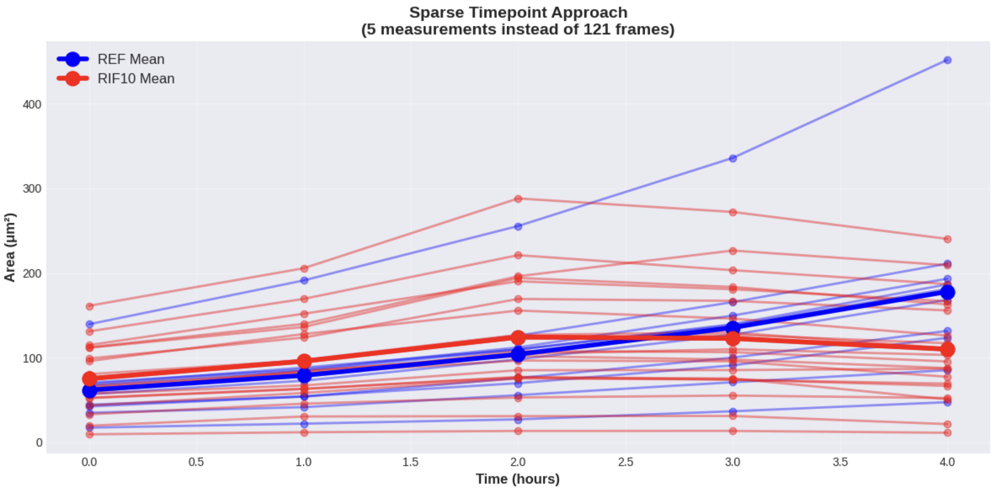
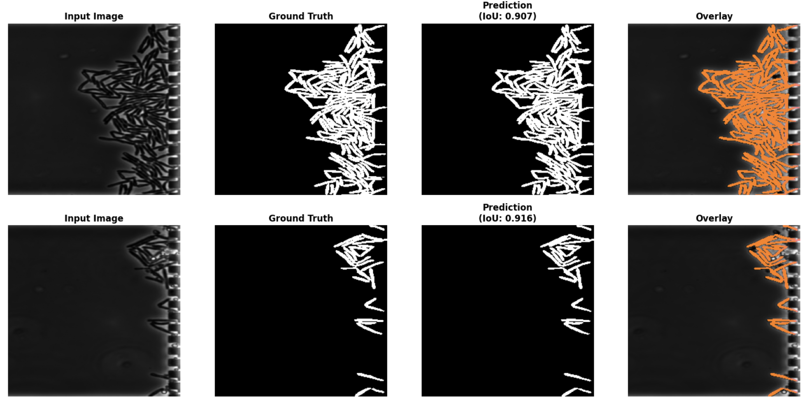

# TB Drug Susceptibility Testing: Area-Based Approach

[](https://www.python.org/downloads/)
[](https://opensource.org/licenses/MIT)

> **Replacing single-cell tracking with sparse population-level area measurements for rapid antibiotic resistance classification**

---

## Overview

This project implements an alternative approach to tuberculosis drug susceptibility testing that **replaces continuous single-cell tracking with sparse timepoint measurements**. By analyzing bacterial population area at just 5 timepoints (0h, 1h, 2h, 3h, 4h) instead of tracking 121 frames, we achieve:

- **100% accuracy** on 27 test samples (20 resistant, 7 susceptible)
- **96% reduction** in computational cost (5 frames vs. 121 frames)
- **3-hour detection** from drug exposure (vs. weeks for culture-based methods)
- **Simple U-Net** (90.6% IoU) sufficient without instance tracking


---

## Repository Structure

```
├── Data_analysis.ipynb          # Exploratory data analysis
├── Classification.ipynb         # Classification 
├── UNet_Bacteria_Seg.ipynb      #U-Net
├── README.md                       # This file
├── outputs
```

---

## Quick Start

### Prerequisites

- Python 3.8 or higher
- Jupyter Notebook or Google Colab
- Data: Pre-segmented bacterial mask images (TIFF format)

### Data Structure

Your data should be organized as follows:
```
data/                                    # Data directory
├── REF_masks101_110/                    # Reference (untreated) samples
│   ├── Pos101/
│   │   └── PreprocessedPhaseMasks/
│   │       ├── MASK_img_000000000.tif
│   │       ├── MASK_img_000000001.tif
│   │       └── ...
│   ├── Pos102/
│   │   └── PreprocessedPhaseMasks/
│   │       └── ...
│   └── ...
└── RIF10_masks201_220/                  # Rifampicin-treated samples
    ├── Pos201/
    │   └── PreprocessedPhaseMasks/
    │       ├── MASK_img_000000000.tif
    │       └── ...
    ├── Pos202/
    └── ...
```

**Data Location Options:**
- **Local:** Place in `./data/` directory in your project folder
- **Google Drive:** Upload to Drive and mount in Colab (instructions in notebook)

**File Requirements:**
- Binary masks (0 = background, 1 or 255 = bacteria)
- TIFF format (`.tif` or `.tiff`)
- Consistent naming: `MASK_img_*.tif`
- One file per timepoint

### Installation

```bash
# Clone the repository
git clone https://github.com/dafnespaccavento/sparse-timepoint-tb-testing.git
cd sparse-timepoint-tb-testing

# Launch Jupyter
jupyter notebook
```

### Running the Analysis

1. **Data Analysis** (`Data_analysis.ipynb`):
   - Loads bacterial area data from mask images
   - Visualizes growth trajectories
   - Analyzes environmental variability
   - Compares sparse vs. continuous tracking
   - Identifies optimal discrimination windows

2. **Train U-Net Segmentation Model** (`UNet_Bacteria_Seg.ipynb`):
   - Implements simple U-Net architecture (3 encoder/decoder levels, ~1.9M parameters)
   - Uses combined BCE + Dice loss with Adam optimizer
   - Saves best model at lowest validation loss

2. **Classification** (`Classification.ipynb`):
   - Part 1: Ground Truth Analysis (All 47 chambers):
      - Tests percentage growth classification on Omnipose masks
      - Evaluates multiple time intervals (0h→4h, 1h→3h, 2h→3h)
   - Part 2: U-Net Pipeline Validation (27 test chambers):
      - Loads trained U-Net and segments held-out test data
      - Extracts bacterial area from U-Net predictions (not ground truth)
      - Re-runs same classification approach

---

## Dataset

### Experimental Setup

- **Imaging:** Time-lapse phase-contrast microscopy (microfluidic chambers)
- **Duration:** 4 hours
- **Frame interval:** 2 minutes 
- **Total frames:** 121 per position
- **Pixel size:** 0.065 μm/pixel

### Samples

| Group | Condition | Positions | Count | Description |
|-------|-----------|-----------|-------|-------------|
| **REF** | Untreated (resistant) | Pos101-110 | 10 | Control samples, no antibiotic |
| **RIF10** | Rifampicin 10 mg/L | Pos201-220 | 20 | Treated samples, all susceptible |

### Paired Design

Positions are paired by microfluidic chamber (same environmental conditions):
- Pos101 ↔ Pos201
- Pos102 ↔ Pos202
- ...
- Pos110 ↔ Pos210

**Note:** Initial bacterial loads vary due to random seeding, but environmental conditions (temperature, nutrients) are shared within pairs.

## Results 
### Optimal Discrimination Window: 2h → 3h

| Group | Mean Growth | Range | Phenotype |
|-------|-------------|-------|-----------|
| **REF (Resistant)** | +29.8% ± 2.9% | +23.9% to +35.1% | Continued exponential growth |
| **RIF10 (Susceptible)** | -2.6% ± 5.2% | -10.4% to +4.9% | Growth arrest/death |

**Classification Performance:**
- Accuracy: **100%** (27/27 samples)
- Threshold: 20% (highly robust)
- Detection time: **3 hours** from drug exposure

### All Time Intervals

| Interval | Threshold | Accuracy | Detection Time |
|----------|-----------|----------|----------------|
| 0h → 4h | 100% | 100% (27/27) | 4 hours |
| 1h → 3h | 50% | 100% (27/27) | 3 hours |
| **2h → 3h** | **20%** | **100% (27/27)** | **3 hours** ⭐ |

### U-Net Segmentation Performance

- **Training IoU:** 92.1%
- **Validation IoU:** 90.6%
- **Training samples:** 2,420 images from 20 chambers

## Visualizations

### 1. Growth Trajectories


### 2. Sparse Timepoint Approach


### 3. U-Net Segmentation Result

